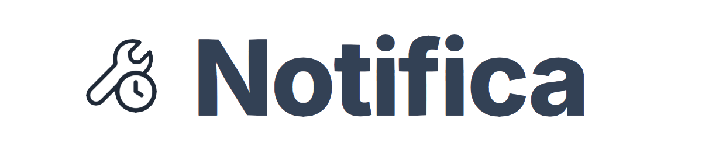
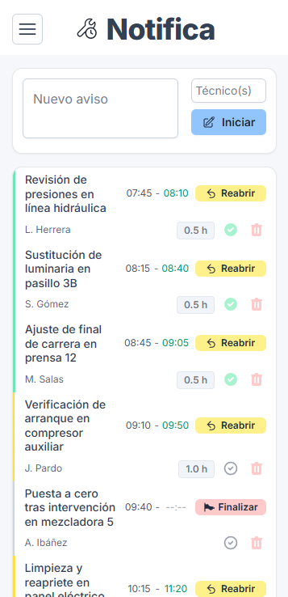
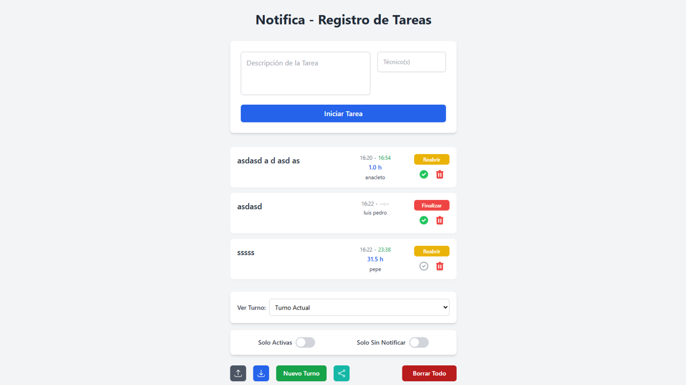
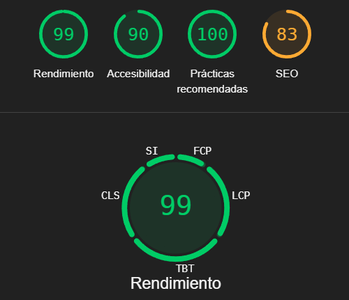

<p align="center">
  
</p>

<p align="center">
  <a href="https://notifica-kappa.vercel.app" target="_blank">
    
  </a>
</p>

# Notifica

Aplicación web progresiva (PWA) para registrar tareas técnicas durante la jornada laboral, con uso optimizado desde el móvil, funcionamiento 100% offline, y diseño cuidado y accesible.

## 📱 Características principales

* Registro ágil de avisos y tareas por turno
* Sincronización offline con almacenamiento local
* Filtros por turno, estado y notificación
* Edición inline, eliminación y reactivación de tareas
* Notificaciones tipo toast con opción de "Deshacer"
* Exportación para compartir con compañeros
* Modo PWA instalable (Android, iOS, escritorio)

## 🖼️ Vista previa

<p align="center">
  
  
</p>

## 🚀 Tecnologías utilizadas

* [Vue 3](https://vuejs.org/)
* [TypeScript](https://www.typescriptlang.org/)
* [Tailwind CSS](https://tailwindcss.com/)
* [Vite](https://vitejs.dev/)
* [vue-sonner](https://github.com/emilkowal/vue-sonner) para notificaciones

## 📦 Instalación y uso

```bash
npm install
npm run dev     # para desarrollo local
npm run build   # para versión de producción
npm run preview # para test de producción local
```

## 🌐 Uso como PWA

* Instalación desde Chrome (Android o Escritorio)
* Funciona offline tras primera carga
* Guarda tareas localmente entre sesiones
* Splash screen personalizado y soporte para icono maskable en Android

## 🛠️ Estructura del código (para desarrolladores)

```
src/
├─ components/         → Componentes visuales (SideMenu, TaskItem, etc.)
├─ composables/        → Lógica reutilizable (useNotifications, etc.)
├─ types/              → Definiciones TypeScript personalizadas
├─ utils/              → Utilidades generales
public/
├─ icons/              → Iconos para manifest.json (maskable incluido)
├─ screenshots/        → Capturas para documentación y manifest
docs/
```

## 📊 Auditoría Lighthouse



* Rendimiento: 99
* Accesibilidad: 90
* Prácticas recomendadas: 100
* SEO: 83

## 🧪 Pruebas en dispositivos

* ✅ Chrome (Windows) — Instalación y funcionamiento offline
* ✅ Android (Chrome) — Instalación y funcionamiento offline
* ✅ iOS (Safari) — Instalación y funcionamiento offline

## 📱 Versión Android (APK)

Notifica también está disponible como aplicación Android, gracias a la integración con Capacitor.

La versión APK es funcionalmente idéntica a la versión PWA, pero se comporta como una app nativa:
* Se instala como aplicación completa desde archivo `.apk`
* Incluye icono personalizado, splash screen y diseño adaptado a móviles
* Integra barra de estado en color compatible con el diseño de la app
* Es independiente de la versión PWA, permitiendo mantener ambas instaladas

Todo el código fuente de la app, incluyendo la plataforma Android, está disponible en este repositorio.

## ⚖️ Licencia

Este proyecto está licenciado bajo la Licencia MIT.
Consulta el archivo [LICENSE](./LICENSE) para más detalles.
