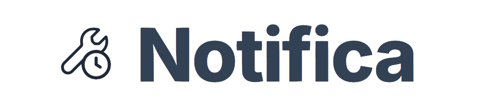
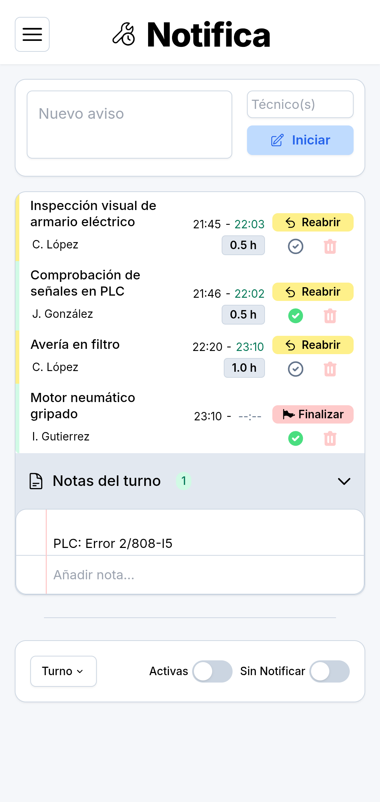
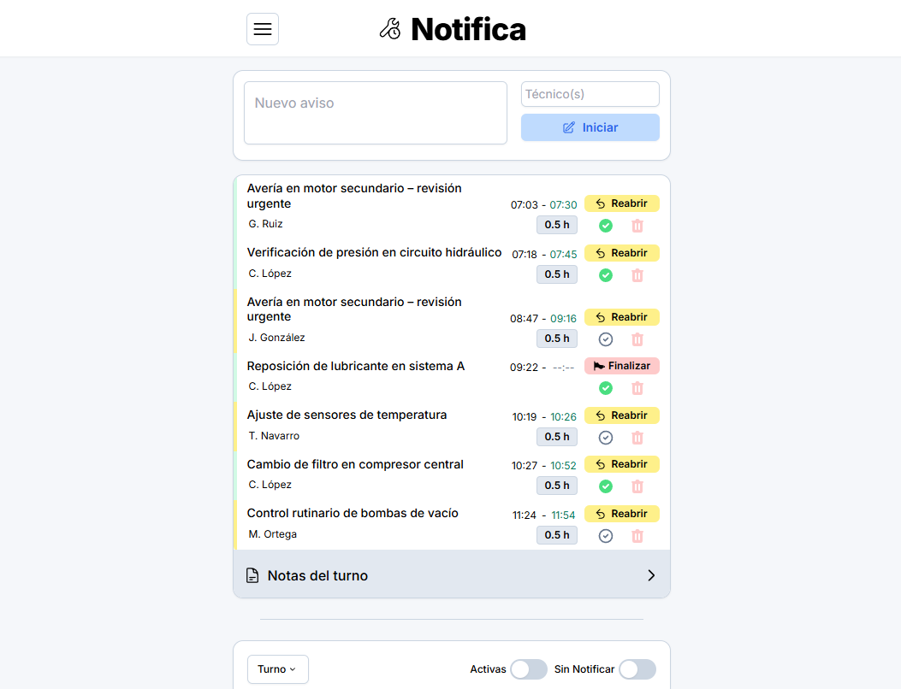

<p align="center">
  
</p>

<p align="center">
  <a href="https://notifica-kappa.vercel.app" target="_blank">
    
  </a>
</p>


# Notifica

Aplicación web progresiva (PWA) para registrar tareas técnicas por tramo durante la jornada laboral. Optimizada para uso móvil, con funcionamiento 100% offline, y diseño cuidado, rápido y accesible.

## Estado actual

La versión estable actualmente en uso es la PWA desplegada en Vercel.

En este repositorio:

* La rama `main` representa esa versión estable en producción
* La rama `develop` concentra la evolución posterior del producto y se usa como base de trabajo y pruebas
* La versión Android nativa mediante Capacitor está preparada como parte de la fase de lanzamiento actualmente en cierre


## 📱 Características principales

📝 Registro y gestión de tareas
* Registro ágil de tareas por tramo
* Edición inline, eliminación y reactivación de tareas
* Filtros por tramo, estado y registro

🗒️ Notas y observaciones del tramo
* Notas por tramo: campo editable tipo cuaderno para registrar observaciones generales
  - Guardado automático por tramo
  - Integrado en la exportación e importación de tareas
  - Diseño accesible, editable y colapsable

📤 Compartir y exportar
* Exportación para compartir con compañeros
* Modo PWA instalable (Android, iOS, escritorio)

🔔 Notificaciones y experiencia visual
* Sistema de notificaciones flotantes con diseño propio:
  - Cuatro tipos de mensaje (éxito, error, información, aviso)
  - Acciones configurables (como "Deshacer")
  - Animaciones suaves, responsive y adaptado a móvil
* Modo claro y oscuro con detección automática del sistema o selección manual
  - Transición visual suave al cambiar de tema
  - Compatible con Android, iOS y escritorio

📶 Sincronización y almacenamiento
* Sincronización offline con almacenamiento local
* Guarda tareas localmente entre sesiones

🌍 Multidioma (español e inglés)
* Selección manual o detección automática (AUTO) según idioma del sistema
* Persistencia en el dispositivo entre sesiones


## 🖼️ Vista previa

<p align="center">
  
  
</p>


## 🚀 Tecnologías utilizadas

* [Vue 3](https://vuejs.org/)
* [TypeScript](https://www.typescriptlang.org/)
* [Tailwind CSS](https://tailwindcss.com/)
* [Vite](https://vitejs.dev/)
* Sistema de toasts propio (sin dependencias externas), con diseño personalizado


## 📦 Instalación y uso

```bash
npm install
npm run dev     # para desarrollo local
npm run build   # para versión de producción
npm run preview # para test de producción local
```


## 🌐 Uso como PWA

* Instalación directa desde Chrome (Android, iOS y escritorio)
* Funciona 100% offline tras la primera carga
* Guarda tareas y notas entre sesiones en el dispositivo
* Splash screen personalizado y soporte para icono adaptativo en Android e iOS


## 🛠️ Estructura del código (para desarrolladores)

```
src/
├─ components/         → Componentes visuales (SideMenu, TaskItem, etc.)
├─ composables/        → Lógica reutilizable (useNotifications, etc.)
├─ types/              → Definiciones TypeScript personalizadas
├─ utils/              → Utilidades generales
public/
├─ icons/              → Iconos para manifest.json (maskable incluido)
├─ screenshots/        → Capturas para documentación y manifest
docs/
```


## 🧪 Pruebas en dispositivos

* ✅ Chrome (Windows) — Instalación y funcionamiento offline
* ✅ Android (Chrome) — Instalación y funcionamiento offline
* ✅ iOS (Safari y Chrome) — Instalación y funcionamiento offline


## 📱 Versión Android (APK)

Notifica también está disponible como aplicación Android, mediante Capacitor.

La versión Android es funcionalmente equivalente a la versión PWA, pero se comporta como una app nativa:
* Puede distribuirse como app Android independiente
* Incluye icono personalizado, splash screen y diseño adaptado a móviles
* Es independiente de la versión PWA, permitiendo mantener ambas instaladas

Todo el código fuente de la app, incluyendo la plataforma Android, está disponible en este repositorio.


## ⚖️ Licencia

Este proyecto está licenciado bajo la Licencia MIT.
Consulta el archivo [LICENSE](./LICENSE) para más detalles.
